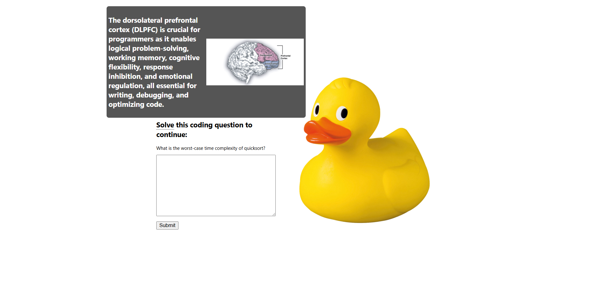

[](https://github.com/gongahkia/dorso/releases/tag/1.0.0)

# `Dorso` 🧠

CAPTCHA but to catch braindead programmers instead of bots.

*(Credits to [Keith Tang](https://www.linkedin.com/in/keibtang/) for the above description.)*

## Rationale

The software development experience in 2025 involves reaching for the closest AI chatbot available, then battling the urge to [punt your laptop across the room](https://media1.tenor.com/m/nJW6x9jzp1AAAAAC/mob-psycho100-mob-psycho.gif) when the chatbot can't understand your poorly worded prompt.

Worried that the convenience and availability of web-based AI chatbots were [making programmers dumber](https://andrewzuo.com/is-ai-making-programmers-stupid-115e9d6e7460), I created `Dorso`.

`Dorso` is a client-sided browser extension that monitors web activity and forces users to correctly answer a random programming question before allowing them access to their [AI chatbot](#details) of choice for the next 15 minutes.

## Screenshot




## Details

### Supported browsers

Find `Dorso` on the [Chrome Web Store](https://chromewebstore.google.com) or [Firefox browser Add-ons](https://addons.mozilla.org/en-US/firefox/).

| Browser | Status | Link |
| :--- | :--- | :--- | 
| Google Chrome |  | ... | 
| Firefox |  | [addons.mozilla.org/en-US/firefox/addon/dorso/](https://addons.mozilla.org/en-US/firefox/addon/dorso/) |
| Safari |  | NIL | 

### Blacklist

`Dorso` checks for web-based AI chatbot access off the following blacklist.

* https://chatgpt.com/
* https://www.perplexity.ai/
* https://gemini.google.com/app
* https://claude.ai/
* https://www.deepseek.com/
* https://copilot.microsoft.com/
* https://socrat.ai/
* https://huggingface.co/chat/
* https://writesonic.com/chat
* https://you.com/
* https://www.jasper.ai/

## Usage

The below instructions are for locally running `Dorso`.

| Browser | Status | 
| :--- | :--- |
| Firefox |  | 
| Google Chrome |  | 
| Safari |  | 

### Firefox

1. Run the below commands.

```console
$ git clone https://github.com/gongahkia/dorso
$ cd dorso
$ make firefox
```
  
2. Copy and paste this link in the search bar *`about:debugging#/runtime/this-firefox`*.
3. Click *load temporary add-on*.
4. Open the `dorso` folder, select `manifest.json`.
5. Open any Web-based AI Chatbot. 

### Chrome

1. Run the below commands.

```console
$ git clone https://github.com/gongahkia/dorso
$ cd dorso
$ make chrome
```

2. Copy and paste this link in the search bar *`chrome://extensions/`*.
3. Toggle *Developer mode* on.
4. Click *load unpacked*.
5. Open the `dorso` folder, click *select*.
6. Open any Web-based AI Chatbot.

## References

The name `Dorso` is in reference to the [dorsolateral prefrontal cortex](https://en.wikipedia.org/wiki/Dorsolateral_prefrontal_cortex), the portion of the brain primarily responsible for solving programming problems.


