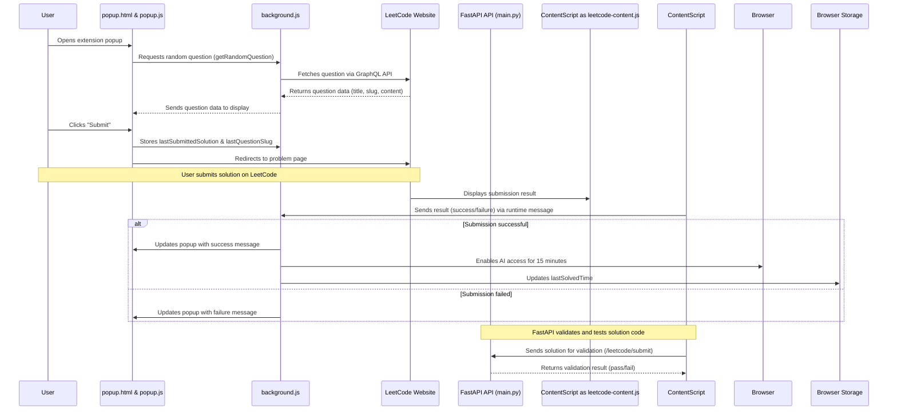

[](https://github.com/gongahkia/dorso/releases/tag/1.0.0)
[](https://github.com/gongahkia/dorso/releases/tag/2.0.0)

# `Dorso` 🧠

CAPTCHA but to catch braindead programmers instead of bots.

## Rationale

The software development experience in 2025 involves reaching for the closest AI chatbot available, then battling the urge to [punt your laptop across the room](https://media1.tenor.com/m/nJW6x9jzp1AAAAAC/mob-psycho100-mob-psycho.gif) when the chatbot can't understand your poorly worded prompt.

Worried that the convenience and availability of web-based AI chatbots were [making programmers dumber](https://andrewzuo.com/is-ai-making-programmers-stupid-115e9d6e7460), I created `Dorso`.

`Dorso` is a client-sided browser extension that monitors web activity and forces users to correctly answer a **Leetcode question** before allowing them access to their [AI chatbot](#details) of choice for the next 15 minutes.

## Stack

### Extension Core
* *Language*: [JavaScript ES6+](https://developer.mozilla.org/en-US/docs/Web/JavaScript)
* *Browser APIs*: [Chrome WebExtension API](https://developer.chrome.com/docs/extensions/) (Manifest v3), [Firefox WebExtension API](https://developer.mozilla.org/en-US/docs/Mozilla/Add-ons/WebExtensions) (Manifest v2)
* *Shared Modules*: Custom adapter pattern for 80% code reuse between browsers
* *Storage*: Browser LocalStorage API with backend sync (offline-first architecture)

### Backend API
* *Language*: [Python 3.11+](https://www.python.org/)
* *Framework*: [Django 5.0](https://www.djangoproject.com/), [Django REST Framework 3.14](https://www.django-rest-framework.org/)
* *Database*: [PostgreSQL 15](https://www.postgresql.org/) (production), SQLite (development)
* *ORM*: [Django ORM](https://docs.djangoproject.com/en/5.0/topics/db/models/) with migrations
* *Cache*: [Redis 7](https://redis.io/) via [django-redis 5.4](https://github.com/jazzband/django-redis)
* *ASGI Server*: [Gunicorn 21](https://gunicorn.org/) with 4 workers
* *Static Files*: [WhiteNoise 6.6](https://whitenoise.readthedocs.io/) (compressed manifest storage)
* *CORS*: [django-cors-headers 4.3](https://github.com/adamchainz/django-cors-headers)

### External APIs
* *LeetCode*: [GraphQL API](https://leetcode.com/graphql) for problem fetching
* *Caching Strategy*: Redis cache-aside pattern (7-day TTL for problems, 15-min for sessions)

### Observability
* *Logging*: [structlog 24.1](https://www.structlog.org/) (structured JSON logging)
* *Metrics*: [prometheus-client 0.19](https://github.com/prometheus/client_python), [django-prometheus 2.3](https://github.com/korfuri/django-prometheus)
* *Monitoring Stack*: [Prometheus](https://prometheus.io/) + [Grafana](https://grafana.com/) (pre-configured dashboards)
* *System Monitoring*: Request latency histograms, solve rate counters, session checks

### Testing
* *Python Testing*: [pytest 7.4](https://docs.pytest.org/), [pytest-django 4.7](https://pytest-django.readthedocs.io/), [pytest-cov 4.1](https://pytest-cov.readthedocs.io/) (>80% coverage target)
* *JavaScript Testing*: [Jest 29.7](https://jestjs.io/) (unit tests for shared modules)
* *E2E Testing*: [Playwright 1.40](https://playwright.dev/) (cross-browser API integration tests)
* *Factories*: [factory-boy 3.3](https://factoryboy.readthedocs.io/), [Faker 22.0](https://faker.readthedocs.io/)

### Code Quality
* *Python Formatting*: [Black 23.12](https://black.readthedocs.io/) (100 char line length)
* *Python Linting*: [Flake8 7.0](https://flake8.pycqa.org/), [isort 5.13](https://pycqa.github.io/isort/)
* *Python Type Checking*: [MyPy 1.8](https://mypy.readthedocs.io/)
* *Security Scanning*: [Bandit 1.7](https://bandit.readthedocs.io/) (Python), Dependency scanning
* *JavaScript Linting*: [ESLint 8.56](https://eslint.org/) (Airbnb config)
* *JavaScript Formatting*: [Prettier 3.1](https://prettier.io/)
* *Pre-commit Hooks*: [pre-commit 3.x](https://pre-commit.com/) (automated quality checks)

### Deployment
* *Containerization*: [Docker](https://www.docker.com/) (multi-stage production builds)
* *Orchestration*: [Docker Compose 3.8](https://docs.docker.com/compose/) (5 services: backend, PostgreSQL, Redis, Prometheus, Grafana)
* *Image Optimization*: Multi-stage builds reduce image size by ~60%
* *Health Checks*: Container-level health monitoring for all services
* *Networking*: Bridge network isolation between services

### Development Tools
* *Package Management*: [pip](https://pip.pypa.io/), [npm](https://www.npmjs.com/)
* *Environment*: [python-dotenv 1.0](https://github.com/theskumar/python-dotenv) (environment variable management)
* *Build Automation*: [Makefile](https://www.gnu.org/software/make/) (browser-specific builds)
* *Version Control*: [Git](https://git-scm.com/) with conventional commits

### Documentation
* *Architecture*: [C4 Model](https://c4model.com/) diagrams (System Context, Container, Component levels)
* *Diagrams*: [Mermaid](https://mermaid.js.org/) (embedded in Markdown)
* *API Docs*: REST API reference with curl and Python examples
* *Guides*: Comprehensive development and deployment documentation

## Screenshot


## Details

### Supported browsers

Find `Dorso` on the [Chrome Web Store](https://chromewebstore.google.com) or [Firefox browser Add-ons](https://addons.mozilla.org/en-US/firefox/).

| Browser | Status | Link |
| :--- | :--- | :--- |
| Google Chrome |  | ... |
| Firefox |  | [addons.mozilla.org/en-US/firefox/addon/dorso/](https://addons.mozilla.org/en-US/firefox/addon/dorso/) |
| Safari |  | NIL |

### Blacklist

`Dorso` checks for web-based AI chatbot access off the following blacklist.

* https://chatgpt.com/
* https://www.perplexity.ai/
* https://gemini.google.com/app
* https://claude.ai/
* https://www.deepseek.com/
* https://copilot.microsoft.com/
* https://socrat.ai/
* https://huggingface.co/chat/
* https://writesonic.com/chat
* https://you.com/
* https://www.jasper.ai/

## Architecture


```mermaid
sequenceDiagram
    participant User
    participant Popup as popup.html & popup.js
    participant Background as background.js
    participant LeetCode as LeetCode Website
    participant FastAPI as FastAPI API (main.py)

    User ->> Popup: Opens extension popup
    Popup ->> Background: Requests random question (getRandomQuestion)
    Background ->> LeetCode: Fetches question via GraphQL API
    LeetCode -->> Background: Returns question data (title, slug, content)
    Background -->> Popup: Sends question data to display

    User ->> Popup: Clicks "Submit"
    Popup ->> Background: Stores lastSubmittedSolution & lastQuestionSlug
    Popup ->> LeetCode: Redirects to problem page

    Note over User,LeetCode: User submits solution on LeetCode

    LeetCode ->> ContentScript as leetcode-content.js: Displays submission result
    ContentScript ->> Background: Sends result (success/failure) via runtime message

    alt Submission successful
        Background ->> Popup: Updates popup with success message
        Background ->> Browser: Enables AI access for 15 minutes
        Background ->> Browser Storage: Updates lastSolvedTime
    else Submission failed
        Background ->> Popup: Updates popup with failure message
    end

    Note over ContentScript,FastAPI: FastAPI validates and tests solution code

    ContentScript ->> FastAPI: Sends solution for validation (/leetcode/submit)
    FastAPI -->> ContentScript: Returns validation result (pass/fail)
```

## Usage

The below instructions are for locally running `Dorso`.

| Browser | Status |
| :--- | :--- |
| Firefox |  |
| Google Chrome |  |
| Safari |  |

### Firefox

1. Run the below commands.

```console
$ git clone https://github.com/gongahkia/dorso
$ cd dorso
$ make firefox
$ cd backend
$ uvicorn main:app --reload
```

2. Copy and paste this link in the search bar *`about:debugging#/runtime/this-firefox`*.
3. Click *load temporary add-on*.
4. Open the `dorso` folder, select `manifest.json`.
5. Open any Web-based AI Chatbot.

### Chrome

1. Run the below commands.

```console
$ git clone https://github.com/gongahkia/dorso
$ cd dorso
$ make chrome
$ cd backend
$ uvicorn main:app --reload
```

2. Copy and paste this link in the search bar *`chrome://extensions/`*.
3. Toggle *Developer mode* on.
4. Click *load unpacked*.
5. Open the `dorso` folder, click *select*.
6. Open any Web-based AI Chatbot.

## References

The name `Dorso` is in reference to the [dorsolateral prefrontal cortex](https://en.wikipedia.org/wiki/Dorsolateral_prefrontal_cortex), the portion of the brain primarily responsible for solving programming problems.


