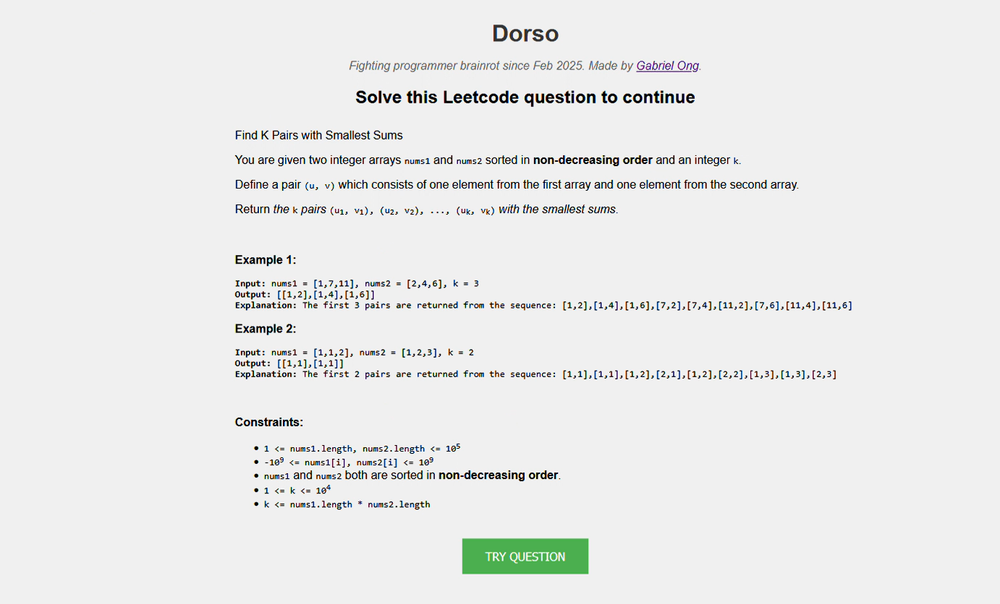
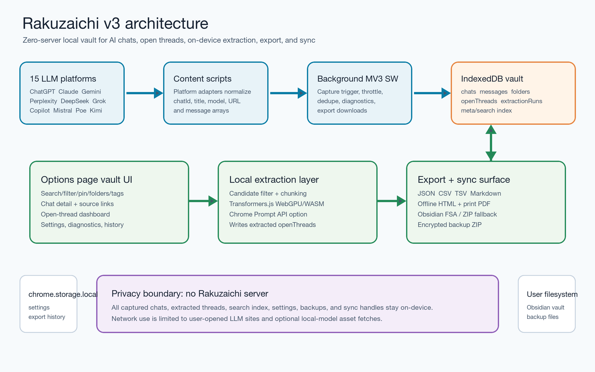
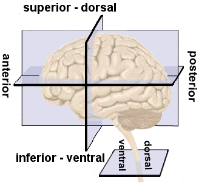

[](https://github.com/gongahkia/dorso/releases/tag/1.0.0)
[](https://github.com/gongahkia/dorso/releases/tag/2.0.0)

# `Dorso`

[CAPTCHA](https://en.wikipedia.org/wiki/CAPTCHA) but to [catch braindead programmers](#architecture) instead of bots.

<div align="center">
    
</div>

## Rationale

The 2025 software development experience involves reaching for the closest AI chatbot available, then battling the urge to [punt your laptop across the room](https://media1.tenor.com/m/nJW6x9jzp1AAAAAC/mob-psycho100-mob-psycho.gif) when the chatbot can't understand your poorly worded prompt.

Worried that the convenience and availability of web-based AI chatbots were [making programmers dumber](https://andrewzuo.com/is-ai-making-programmers-stupid-115e9d6e7460), I created `Dorso`.

`Dorso` is a client-sided browser extension that monitors web activity and forces users to correctly answer a **Leetcode question** before allowing them access to their [AI chatbot](#details) of choice for the next 15 minutes.

## Stack

* *Script*: [JavaScript](https://developer.mozilla.org/en-US/docs/Web/JavaScript)
* *Backend*: [Python](https://www.python.org/), [Gunicorn 21](https://gunicorn.org/)
* *API*: [Chrome WebExtension API](https://developer.chrome.com/docs/extensions/), [Firefox WebExtension API](https://developer.mozilla.org/en-US/docs/Mozilla/Add-ons/WebExtensions), [LocalStorage API](https://developer.mozilla.org/en-US/docs/Web/API/Window/localStorage), [LeetCode GraphQL API](https://leetcode.com/graphql) 
* *DB*: [Django](https://www.djangoproject.com/), [Django REST](https://www.django-rest-framework.org/), [PostgreSQL](https://www.postgresql.org/)
* *Cache*: [Redis](https://redis.io/)
* *Observability*: [Prometheus](https://github.com/prometheus/client_python), [Grafana](https://grafana.com/) 
* *Logs*: [structlog](https://www.structlog.org/)
* *CI/CD*: [GitHub Actions](https://github.com/features/actions), [Pytest](https://docs.pytest.org/), [Jest](https://jestjs.io/), [Playwright](https://playwright.dev/) 
* *Package*: [Docker](https://www.docker.com/) 

## Screenshot




## Details

### Versions

* `Dorso v1.0.0` is available as an Add-on for Firefox [here](https://addons.mozilla.org/en-US/firefox/addon/dorso/).
* `Dorso v2.0.0` is available as an Add-on for Firefox [here](https://addons.mozilla.org/en-GB/firefox/addon/dorso-2/).

### Blacklist

`Dorso` checks for web-based AI chatbot access off the following blacklist.

* https://chatgpt.com/
* https://www.perplexity.ai/
* https://gemini.google.com/app
* https://claude.ai/
* https://www.deepseek.com/
* https://copilot.microsoft.com/
* https://socrat.ai/
* https://huggingface.co/chat/
* https://writesonic.com/chat
* https://you.com/
* https://www.jasper.ai/

### Supported browsers

Find `Dorso` on the [Chrome Web Store](https://chromewebstore.google.com) or [Firefox browser Add-ons](https://addons.mozilla.org/en-US/firefox/).

| Browser | Status | Link |
| :--- | :--- | :--- |
| Firefox |  | [addons.mozilla.org/en-US/firefox/addon/dorso/](https://addons.mozilla.org/en-US/firefox/addon/dorso/) |
| Google Chrome |  | NIL |
| Safari |  | NIL |

## Architecture



## Usage

The below instructions are for locally running `Dorso`.

### Firefox

1. Run the below commands.

```console
$ git clone https://github.com/gongahkia/dorso
$ cd dorso
$ make firefox
$ cd backend
$ uvicorn main:app --reload
```

2. Copy and paste this link in the search bar *`about:debugging#/runtime/this-firefox`*.
3. Click *load temporary add-on*.
4. Open the `dorso` folder, select `manifest.json`.
5. Open any Web-based AI Chatbot.

### Chrome

1. Run the below commands.

```console
$ git clone https://github.com/gongahkia/dorso
$ cd dorso
$ make chrome
$ cd backend
$ uvicorn main:app --reload
```

2. Copy and paste this link in the search bar *`chrome://extensions/`*.
3. Toggle *Developer mode* on.
4. Click *load unpacked*.
5. Open the `dorso` folder, click *select*.
6. Open any Web-based AI Chatbot.

## References

The name `Dorso` is in reference to the [dorsolateral prefrontal cortex](https://en.wikipedia.org/wiki/Dorsolateral_prefrontal_cortex), the portion of the brain primarily responsible for solving programming problems.

<div align="center">
    
</div>
