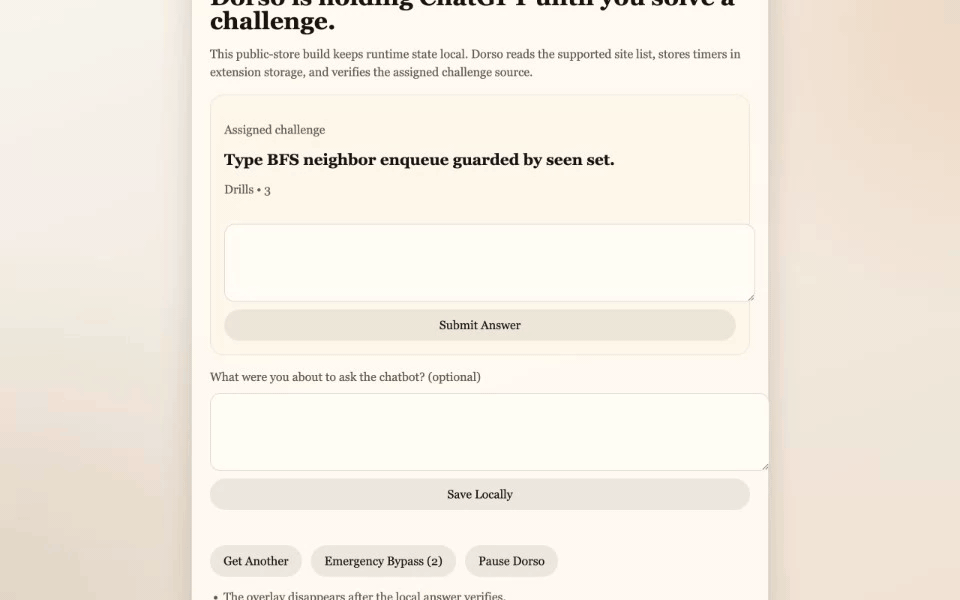

# Dorso

Dorso is our local-only CAPTCHA for AI-era programming atrophy: before selected chatbot sites open, we solve a short coding challenge, earn a timed unlock, and keep the evidence on-device. The premise is not anti-AI; it is anti-autopilot. InfoQ's February 2026 summary of Anthropic's randomized controlled trial reports that AI-assisted developers scored 17% lower on skill-mastery checks while productivity gains were not statistically significant, so Dorso turns that finding into a small friction loop that protects deliberate practice without accounts, analytics, or a backend.

## Install

### Chrome / Chromium

1. Run `npm ci && npm run build:chrome`.
2. Open `chrome://extensions`, enable Developer mode, choose Load unpacked, and select `dist/chrome`.
3. Configure challenge sources and protected chatbot sites from the Dorso popup.

### Firefox

1. Run `npm ci && npm run build:firefox`.
2. Open `about:debugging#/runtime/this-firefox`, choose Load Temporary Add-on, and select `dist/firefox/manifest.json`.
3. Configure challenge sources and protected chatbot sites from the Dorso popup.

Safari is deferred for v3.0 store polish.

## Privacy

Dorso stores challenge state, timers, settings, solve receipts, and saved prompt notes in browser extension storage. The extension has no accounts, no analytics, no telemetry, and no remote problem-statement fetch path. The optional SVG badge is stateless: badge state is HMAC-signed into the URL and served by a Cloudflare Worker without per-user storage. Details: [docs/PRIVACY.md](./docs/PRIVACY.md).

Optional CLI export writes a local JSON status file under the browser Downloads directory for `dorso status`; it does not send status to a server.

## Tech Stack

- JavaScript ES modules
- esbuild extension bundling
- Chrome and Firefox WebExtension APIs
- Optional `@dorso/cli` Node companion
- Local `chrome.storage.local` state
- JSON challenge packs with AJV schema validation
- MCQ, drill, LeetCode, Advent of Code, and Project Euler challenge providers
- GitHub Actions for CI
- Optional Cloudflare Worker for signed SVG badges

## Contributing

Challenge-pack contributions are the best first PRs. Keep prompts original, keep IDs stable, validate with `npm run validate:packs`, and follow [CONTRIBUTING.md](./CONTRIBUTING.md). Issue templates include a dedicated challenge-pack path under `.github/ISSUE_TEMPLATE/`.

## References

- Dorso is named after the [dorsolateral prefrontal cortex](https://en.wikipedia.org/wiki/Dorsolateral_prefrontal_cortex), the brain region associated with executive control and problem solving.
- InfoQ: [Anthropic Study: AI Coding Assistance Reduces Developer Skill Mastery by 17%](https://www.infoq.com/news/2026/02/ai-coding-skill-formation/)
- Anthropic Research: [How AI assistance impacts the formation of coding skills](https://www.anthropic.com/research/AI-assistance-coding-skills)
- Architecture notes: [docs/ARCHITECTURE.md](./docs/ARCHITECTURE.md)
- Screenshots: [popup](./asset/reference/popup.png), [gate](./asset/reference/gate.png), [badge](./asset/reference/badge.png), [digest](./asset/reference/digest.png)
