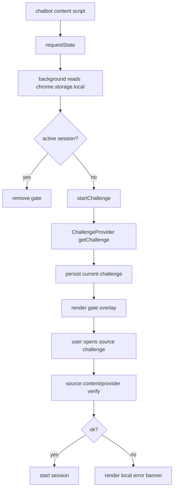
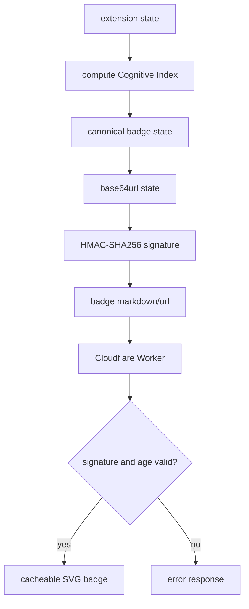
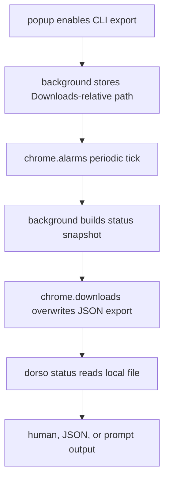

# Architecture

## Module Map

- `src/extension/background/`: extension service worker/background script. Owns storage-backed state, challenge rotation, session grants, settings, and runtime messages.
- `src/extension/content/`: page scripts for chatbot gate rendering and LeetCode submission detection.
- `src/extension/ui/`: popup dashboard, settings, saved-prompt review, and digest exports.
- `src/extension/lib/`: browser/runtime helpers and local SVG renderers.
- `src/shared/core/`: constants, provider contracts, scoring, and streak logic shared by build targets.
- `src/shared/data/`: bundled challenge packs.
- `cli/`: standalone `@dorso/cli` package that reads local status JSON exports.
- `schemas/`: JSON Schemas for community challenge packs.
- `cloudflare/`: optional stateless SVG badge Worker.
- `scripts/`: extension build and Safari wrapper sync scripts.

## Gate Flow

## Badge Flow

## CLI Flow

## Storage

All extension runtime state is stored in `chrome.storage.local`. The background script treats storage as authoritative because MV3 service workers can be stopped and restarted between events.
