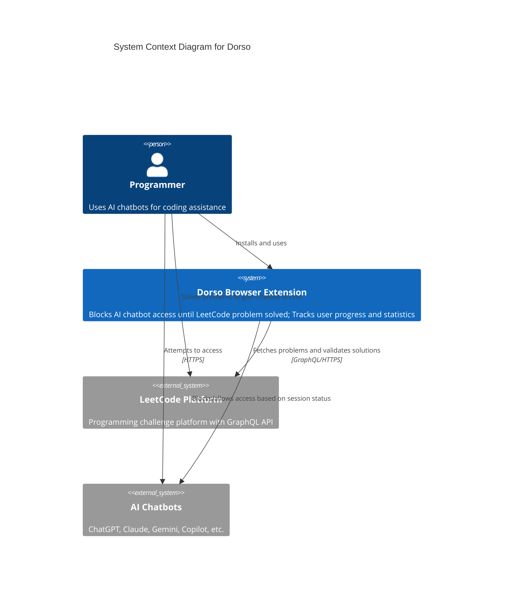
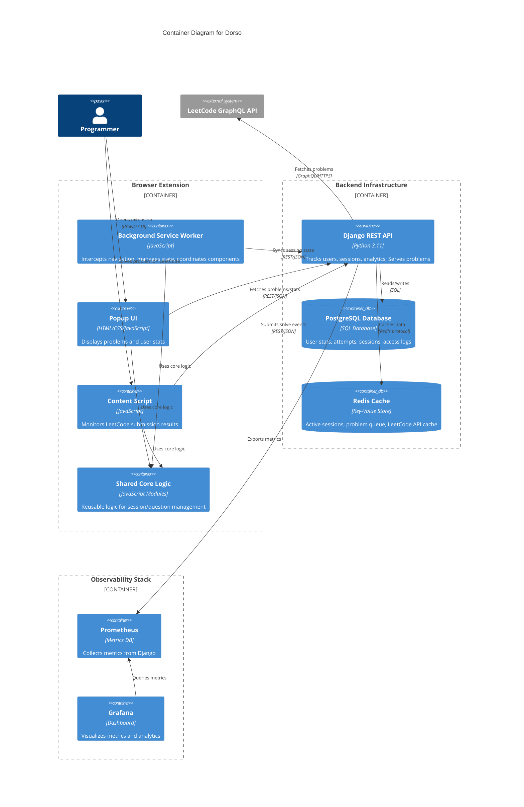
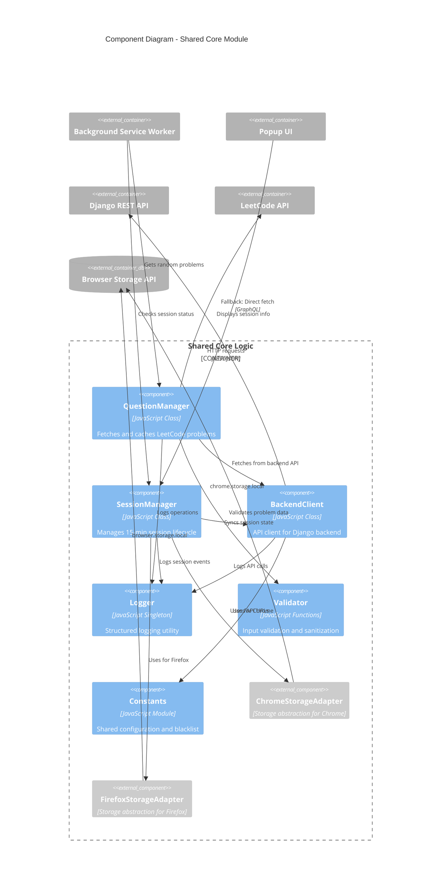
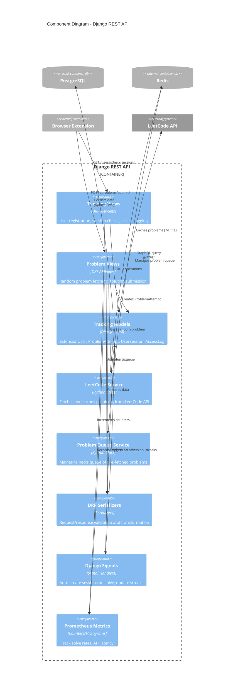
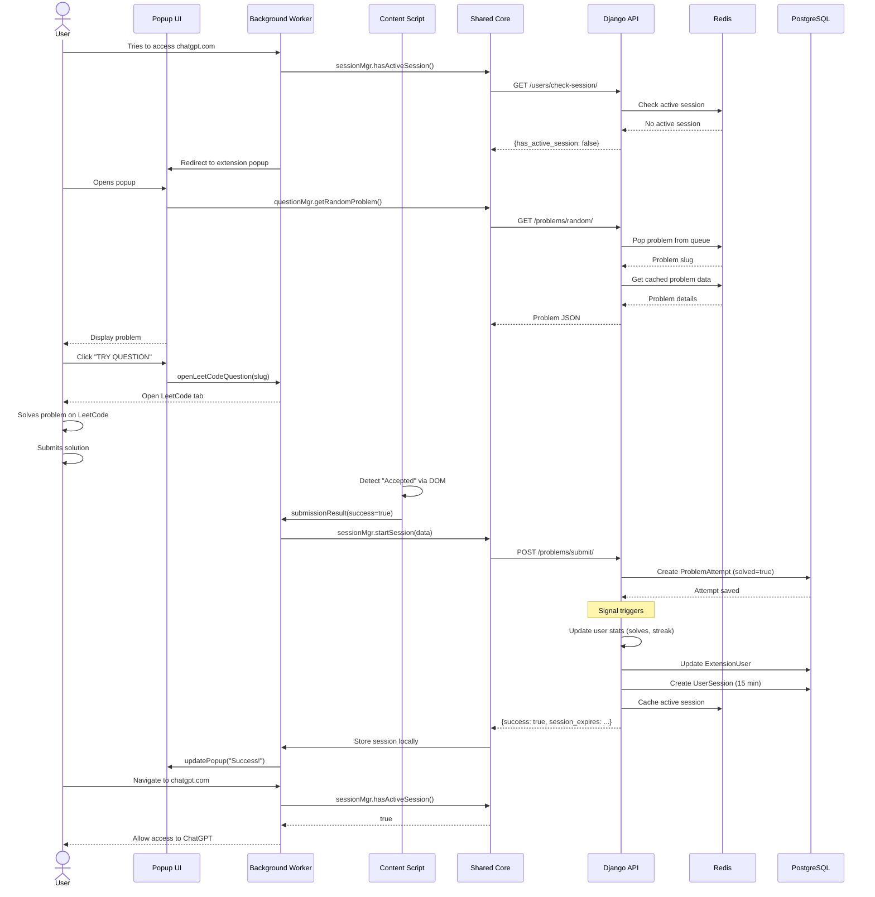
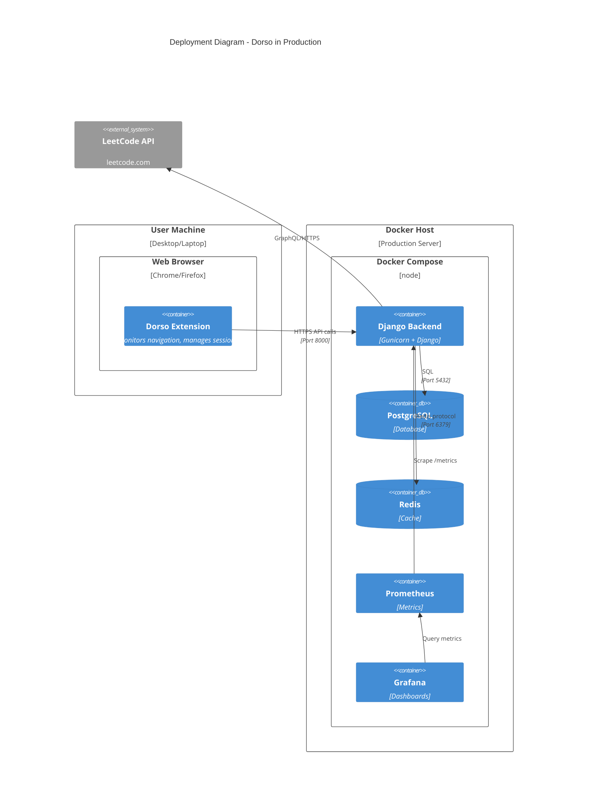

# C4 Architecture Diagrams for Dorso

This document contains C4 model architecture diagrams for Dorso at different levels of abstraction.

## Level 1: System Context Diagram

Shows how Dorso fits into the larger ecosystem and its external dependencies.

**Key Interactions:**
- Users install Dorso extension to enforce programming practice
- Extension intercepts navigation to AI chatbot URLs
- Extension fetches random LeetCode problems via API
- Users solve problems on LeetCode to earn chatbot access
- Extension validates solution submission and grants 15-minute access

---

## Level 2: Container Diagram

Shows the high-level technical building blocks of Dorso.

**Container Responsibilities:**

**Extension:**
- **Background Service Worker**: Core orchestration, navigation interception, state management
- **Popup UI**: User interface for viewing problems and statistics
- **Content Script**: Detects LeetCode submission results via DOM monitoring
- **Shared Core Logic**: Browser-agnostic business logic (80% code reuse)

**Backend:**
- **Django REST API**: User tracking, session management, problem serving, analytics
- **PostgreSQL**: Persistent storage for users, attempts, sessions, access logs
- **Redis**: High-speed caching for active sessions and problem queue

**Observability:**
- **Prometheus**: Metrics collection (solve rates, API latency, etc.)
- **Grafana**: Real-time dashboard visualization

---

## Level 3: Component Diagram - Shared Core Logic

Shows internal components of the shared JavaScript module.

**Component Responsibilities:**

1. **QuestionManager**:
   - Fetches problems from backend (preferred) or LeetCode (fallback)
   - Caches problem data locally (7-day TTL)
   - Validates problem structure

2. **SessionManager**:
   - Tracks 15-minute session duration
   - Checks local & backend for active sessions (offline-first)
   - Starts/ends sessions based on solve events

3. **BackendClient**:
   - Centralizes all HTTP communication with Django
   - Handles user registration, problem submission, analytics logging
   - Implements error handling and retries

4. **Logger**:
   - Structured logging with context (timestamp, level, component)
   - Sends ERROR logs to backend for monitoring

5. **Validator**:
   - Input validation (problem data, URLs, session data)
   - HTML sanitization for security

6. **Storage Adapters**:
   - Abstract browser-specific storage APIs (Chrome vs Firefox)
   - Enable shared code to work across browsers

---

## Level 3: Component Diagram - Django Backend

Shows internal structure of the Django REST API.

**Component Responsibilities:**

1. **Tracking Views**: REST endpoints for user management and analytics
2. **Problem Views**: REST endpoints for problem fetching and submission
3. **Tracking Models**: ORM models with business logic (streak calculation, session expiry)
4. **LeetCode Service**: Fetches problems from GraphQL API with caching
5. **Problem Queue Service**: Maintains Redis queue of 20 pre-fetched problems for low latency
6. **Serializers**: Input validation, output formatting, custom error handling
7. **Signals**: Event-driven updates (auto-create session on solve, update stats)
8. **Prometheus Metrics**: Exports metrics for observability dashboard

---

## Data Flow: Successful Problem Solve

---

## Deployment Architecture

**Infrastructure:**
- **User Machine**: Browser extension runs locally
- **Docker Host**: All backend services containerized
- **PostgreSQL**: Persistent data storage
- **Redis**: Session cache and problem queue
- **Prometheus + Grafana**: Observability stack

---

## Technology Choices & Trade-offs

| Decision | Choice | Rationale | Trade-off |
|----------|--------|-----------|-----------|
| **Backend Framework** | Django + DRF | Batteries-included (ORM, admin, migrations), rapid development | Heavier than FastAPI, but feature-rich |
| **Database** | PostgreSQL | Relational data model fits analytics queries, ACID guarantees | More complex than SQLite, but production-ready |
| **Cache** | Redis | Sub-ms session lookups, persistent cache, data structures (lists for queue) | Requires separate service vs in-memory cache |
| **Code Sharing** | Shared JS module + adapters | 80% code reuse between Chrome/Firefox | Adds abstraction layer complexity |
| **Problem Fetching** | Backend API (Django) with Redis queue | Centralized caching, analytics, pre-fetching reduces latency | Extension offline mode requires fallback |
| **Session Storage** | Hybrid (local + backend) | Offline-first UX, backend as source of truth | Requires sync logic |

---

## Security Considerations

1. **No User Authentication**: Extension users identified by runtime ID only (privacy-preserving)
2. **CORS Configuration**: Only allows chrome-extension:// and moz-extension:// origins
3. **Input Validation**: All API inputs validated via Pydantic/DRF serializers
4. **HTML Sanitization**: LeetCode problem content sanitized before rendering
5. **No Secrets in Code**: Environment variables for sensitive config
6. **HTTPS Only**: All external API calls use HTTPS
7. **Rate Limiting**: DRF throttling prevents API abuse (1000 req/hour)

---

These diagrams provide multiple levels of abstraction to explain Dorso's architecture during technical interviews, demonstrating understanding of:
- System design principles (separation of concerns, abstraction)
- Scalability patterns (caching, queueing)
- Production best practices (observability, security)
- Modern tech stack (Django, Redis, Docker, Prometheus)
